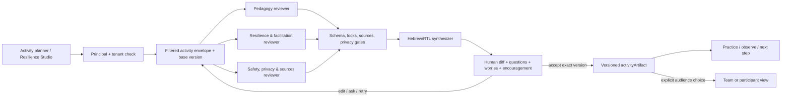
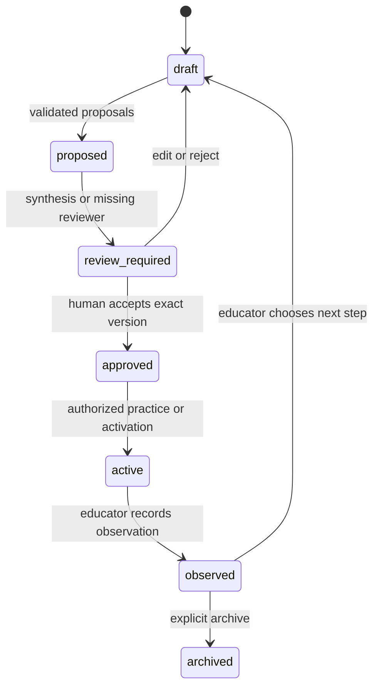
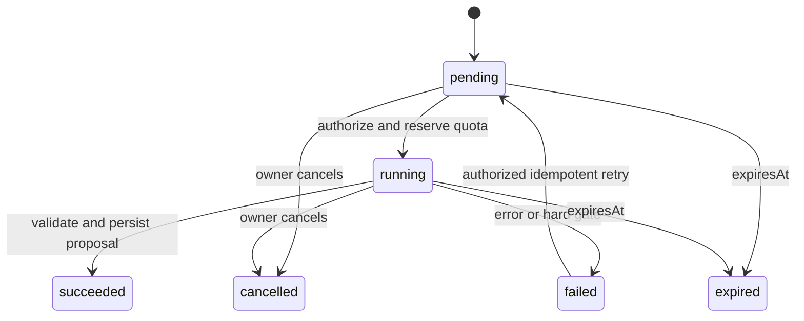
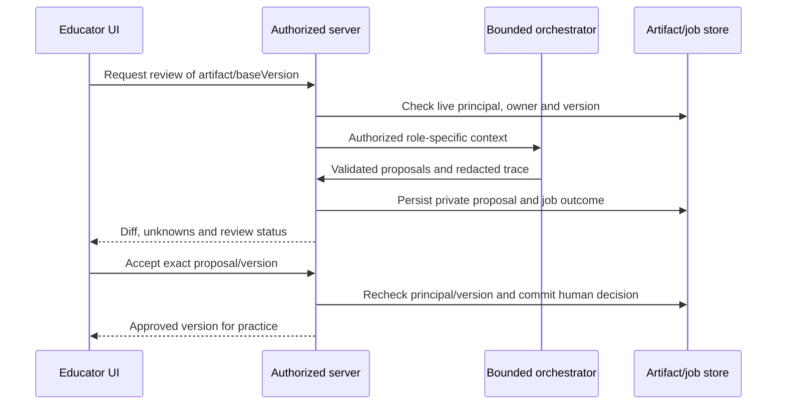

# Be Good — תכנית עבודה לצוות סוכנים מבוקר ולשיפור המערכת

**מאגר יעד:** [THEOWLWITCH/SBE](https://github.com/THEOWLWITCH/SBE). נתיבי קוד במסמך יחסיים לשורש המאגר. קישורי מסמכים יחסיים לתיקיית חבילת המסירה. בסיס הסקירה: main ב-`583bac5fe79bde02e7103c0ac7d8a751a08f5dbf`; יש לאמת שינויים חדשים לפני מימוש.

## Goal Capsule

**תוצאה רצויה.** Be Good תאפשר להכין פעילות חינוכית, לשאול על כל שלב, לבקש שיפור, לשתף חששות ולקבל עידוד, ולאחר מכן להפעיל, להתבונן ולבחור צעד המשך מתוך אותו תוצר מאושר. כל פעילות תציג במפורש את מטרתה, רכיבי החוסן, המיומנויות האישיות והמיומנויות המשותפות שהיא מפתחת. מדריך ההנחיה והמנגנון החברתי יישארו חלק מהתוצר. תוספות שכבר קיימות בטיוטת סטודיו חוסן (#133) יחוברו לחוזה המשותף במקום להיבנות שוב.

**המלצה ארכיטקטונית.** להוסיף צוות קטן ומבוקר של שלושה סוכנים מומחים ועורך מסכם:

1. **מתכנן פדגוגי** — מטרה, קהל, ידע קודם, תפיסות שגויות, הערכה ומסלולי השתתפות.
2. **בודק חוסן והנחיה** — מטרת החוסן, רכיבים, מיומנויות אישיות ומשותפות, הנחיית קבוצה, חששות ועידוד.
3. **בודק בטיחות, פרטיות ומקורות** — הרשאות, צמצום מידע, נגישות, מקורות, מגבלות וסיכונים.
4. **עורך מסכם** — מאחד הצעות סותרות, מציג הנחות ושאלות פתוחות ומכין טיוטה בעברית/RTL. הוא אינו מאשר, מפרסם, שולח או משייך תוצר למשתתפים.

הסוכנים יכולים לעבוד במקביל מול אותה גרסת תוצר; כל תפקיד מקבל את השדות שמותר ונחוץ לו לראות. העורך מקבל את ההצעות המאומתות בלבד. כל סוכן מחזיר הצעה במבנה מוגדר עם שדות שהשתנו, נימוק, מקורות, אי־ודאויות וסימני סיכון. המערכת ושיקול דעת אנושי קובעים אם ההצעה מאומצת.

**היררכיית סמכות.** החלטת המשתמשת והאישור המקצועי קודמים להצעת מודל; `CLAUDE.md` וכללי החוסן קודמים לנוחות מימוש; הרשאת השרת קודמת לנתוני לקוח; הדוח הזה מתרגם את הסקירה ליחידות ביצוע ואינו מחליף החלטה מקצועית של יעל על תוכן, הגנה, פרטיות או פרסום.

**בעלות על העבודה.** Codex הכין סקירה, ראיות שחזור, תכנית, מטריצת קבלה וערכת הערכה. Codex יכול להוביל בעצמו את תיקוני התשתית, הבדיקות והמימוש; אין צורך להמתין ל-Claude. Claude מתבקש לתת ביקורת עצמאית על הארכיטקטורה, ההקשר ההיסטורי במאגר, חוזה Anthropic והניסוחים המקצועיים, ולהמשיך מאותה נקודת עבודה אם יעל תבחר בו כמבצע. לא נערכה השוואה המוכיחה עדיפות כללית של מודל אחד. יעל תאשר תוכן, מדיניות מקומית, מקורות, ניסוח למנחות והשקה. אין לבצע כתיבה לפרודקשן, שליחה, פרסום או הפעלת תהליך עם נתוני תלמידים בלי אישור מפורש של יעל.

**תנאי עצירה.** עוצרים את הריצה ומשמרים את הגרסה התקינה האחרונה אם בדיקת הרשאות נכשלת, מידע פרטי נחשף לסוכן ללא מטרה/סיווג/הרשאה מתאימים או נכתב ב-trace רגיל, פלט לא תקין עובר שער, תוצר חלקי מקבל סטטוס מאושר, או בדיקת רגרסיה של מסך קיים נכשלת. מתקנים ומריצים מחדש את הבדיקה שנכשלה לפני המשך. כל שינוי סכמה דורש גיבוי, תכנית מעבר ודרך שחזור לפני הפעלה על מידע קיים.

---

## Product Contract

### Problem frame

המערכת עשירה בכלים אך כיום המסכים, הטיוטות, הקריאות ל-AI והשמירה מפוצלים. הסקירה שיחזרה בעיות P1 בהגנת שרת, בבעלות בין מוסדות, בביטול אסימון, במקביליות, בנתוני טיוטה, במתאם הספק ובשערי איכות (F01–F08). הוספת סוכנים לפני תיקונם תכפיל עלות, דליפות ופלטים לא אמינים. לכן הפעילות הראשונה היא לבנות תשתית אמינה לתוצר אחד, ורק אחר כך למדוד אם צוות סוכנים משפר את ההכנה לעומת סוכן יחיד.

### Requirements

**תשתית וחוזים — R1–R5.**

- **R1 — זהות ובעלות:** כל קריאת AI, job, תוצר, טיוטה, מקור ואישור משויכים ל-principal ולמוסד שנגזרו בשרת. `institutionId` שנשלח מהדפדפן אינו מקור סמכות.
- **R2 — חוזה ספק אחיד:** מתאם הספק מטפל באופן זהה בהודעות, system, קבצים, כלים, tool choice, סירוב, קטיעה, שימוש ושגיאות. החלפת מודל אינה מותרת לפני בדיקות החוזה.
- **R3 — תוצר פעילות משותף:** יש `activityArtifact` אחד עם מזהה יציב, גרסה, בעלים, קהל, סטטוס, מטרה, קהל/גיל, אילוצים, רכיבי פעילות, חששות, מדריך הנחיה, מנגנון חברתי, מקורות, הצעות והחלטות.
- **R4 — תפקידי סוכנים מוגבלים:** לכל סוכן הקשר מצומצם ותפקיד מתועד. אין סוכן כללי עם כתיבה למסד הנתונים או שליחה החוצה.
- **R5 — חוזה פלט ושערים:** כל הצעה נבדקת לפי סכמה, שדות חובה, שדות נעולים, מקורות מורשים, פרטיות, שפה, בטיחות ומגבלות הפעילות. פלט ריק/חלקי/מומצא אינו הצלחה.

**סמכות, פרטיות ותפעול — R6–R9.**
- **R6 — אישור אנושי:** הצגה של לפני/אחרי, הנחות, אי־ודאויות, מקורות, שדות רגישים ומי יקבל את התוצר. רק אישור מפורש לגרסה מסוימת מקדם אותה ל-approved/active/shared.
- **R7 — פרטיות וצמצום הקשר:** private, team, participant ו-research הם מחלקות מידע נפרדות. מחשבות וחששות של המתכננת אינם נכנסים אוטומטית לחומר משתתפים או לייצוא מחקר.
- **R8 — jobs אמינים:** job כולל owner, artifact/version, idempotency, ניסיון, checkpoint, תפוגה, ביטול, שגיאה ומדדי עלות/זמן. polling בודק בעלות; jobId לבדו אינו הרשאה.
- **R9 — trace והערכה:** כל פעולה מקבלת correlation/run/job id; trace מצומצם ומושחר; ניתן להשוות סוכן יחיד לצוות על אותם קלטים ולראות מי הציע מה ומי אישר.

**חוויית עבודה ושוויון גישה — R10–R12.**
- **R10 — חוויית הכנה:** בכל שלב אפשר לשאול שאלה, לבקש שינוי, לדווח על פחד/חשש ולקבל עידוד ענייני; אפשר להוסיף/להסיר שלב; כל פעילות מציגה מטרה, רכיבי חוסן ומיומנויות אישיות/משותפות. פעולות קיימות ב-Studio #133 יישמרו ויחוברו לחוזה.

המנגנון החברתי הוא בחירה של המתכננת: תדירות, תפקיד, לוח/יום/ועדה או מנגנון אחר המתאים למסגרת. כשעדיין לא נבחר מנגנון, הדבר מסומן עם שאלה להמשך; אין להמציא סמכות או התחייבות. שדה זה מתעד את הבחירה או את היעדרה, ולא מחייב כל פעילות להפוך לאירוע קבוע. מדריך הנחיה מותאם לפעילות הקבוצתית ולניסיון המנחה.
- **R11 — fallback בטוח:** כשל של סוכן אחד מאפשר טיוטה חלקית מסומנת או מעבר לסוכן יחיד לפי מדיניות, בלי להציג אותה כמאושרת ובלי חיוב כפול.
- **R12 — שוויון פעולה והקשר לסוכנים:** כל פעולה שסוכן יכול לבצע עוברת אותה הרשאה, סינון מידע ואישור כמו UI; לסוכן אין גישה רחבה יותר מן המחנכת או מן המשתתפת.

### Success criteria

| תחום | מדד קבלה לפני פיילוט |
|---|---|
| אמינות | F01–F08 מקבלים בדיקות חוזיות שעוברות; אין success ללא תוצר שעבר סכמה ושערים |
| איכות תכנון | כל פעילות מאושרת כוללת מטרה, רכיבי חוסן, מיומנויות אישיות ומשותפות, הנחיה ומנגנון חברתי שעברו שערים; טיוטה חסרה מציגה את החסר ונשארת draft/review_required |
| ערך הסוכנים | לפני ההשוואה יעל קובעת מדד שיפור ראשי, רף לכל ממד חובה ותקרות עלות/זמן; הצוות משפר את המדד הראשי, עומד ברפים ובתקרות וללא נסיגה בבטיחות/פרטיות; אחרת נשאר מסלול סוכן יחיד |
| שליטת אדם | כל שינוי נראה כ-diff; אין שמירה, שיתוף, שליחה, תעודה או אישור מסע ללא פעולה אנושית מתועדת |
| פרטיות | אפס דליפות ב-fixtures סינתטיים; אין free text מזוהה בייצוא ברירת המחדל או ב-trace |
| תפעול | jobs פגים, ניתנים לביטול ולחזרה; retry אינו מכפיל quota, שמירה, הודעה או אישור |
| המשכיות | ניתן לפתוח את אותה גרסה, לשאול על שלב, לערוך, לחזור אחורה ולהמשיך בלי יצירת AI מחדש |
| ביצועים ועלות | נמדדים latency, retries, tokens/cost לכל סוכן ולעורך; חריגה מהתקרה עוצרת את הריצה או עוברת למסלול חסכוני מסומן |

### Actors and boundaries

- **מחנכת/מתכננת:** מגדירה מטרה, אילוצים, חששות, בחירות ופרטיות; מאשרת תוכן ומחליטה מה לשתף.
- **סוכנים מומחים:** מנתחים את הקלט המותר ומציעים patches/שאלות/סיכונים. הם אינם בעלי סמכות.
- **עורך מסכם:** מנסח תוצר קריא, משמר מחלוקות ומציג שאלות פתוחות.
- **שרת/ספק:** מאמת principal, tenant, quota, schema, gates, version ו-retention.
- **מנחה/עמיתה:** יכולה לקבל גרסה משותפת אם המתכננת בחרה קהל והרשאת השיתוף מאפשרת זאת.
- **משתתפים/לומדים:** רואים רק participant view שאושר; אינם מקבלים private notes, hidden context או trace.

### Key flows

1. **יצירה:** המתכננת פותחת פעילות, מגדירה מטרה/קהל/אילוצים ומסמנת private/team/participant. השרת יוצר artifact פרטי בגרסה 1.
2. **הפקת הצעות:** שלושת המומחים מקבלים בסיס גרסה קבוע והקשר מסונן לפי תפקיד; כל אחד מחזיר proposal. שערים דוחים פלט חסר או לא מורשה. proposals תקינים נשמרים כטיוטות פרטיות בלי אישור שימוש.
3. **שיחה על שלב:** המתכננת שואלת, מציינת פחד/חשש או מבקשת שיפור. הסוכן עונה בהקשר של אותו שלב ומציע שינוי חדש מול אותה גרסה; לא מוחקים את ההצעה הקודמת.
4. **עריכה ואישור:** העורך מציג before/after, מקורות, הנחות, אי־ודאויות, רכיבי חוסן, מיומנויות, מדריך ומנגנון חברתי. המתכננת מאמצת, משנה, דוחה או מבקשת סבב נוסף.
5. **הפעלה והתבוננות:** רק גרסה approved/active נכנסת לתרגול/הפעלה. תצפית נשמרת כ-observation, לא כהוכחה אוטומטית לשיפור חוסן.
6. **כשל/ביטול:** סוכן שנכשל מסומן; אפשר retry idempotent או fallback. job שפג אינו מעדכן artifact. ביטול משאיר גרסה קודמת תקפה.
7. **שיתוף:** מעבר מ-private ל-team/participant/research דורש קהל, סיבה והרשאה. אין שליחה או פרסום אוטומטי.

### Acceptance examples

- **AE1:** בקשה ל-`/api/complete`, `/api/character-turn`, `/api/pipeline` או polling ללא principal תקף נדחית לפני ספק.
- **AE2:** משתמשת ממוסד A אינה קוראת, מעדכנת, מוחקת או רואה job/artifact של B; אסימון שבוטל אינו פועל בפעולה מוגנת.
- **AE3:** OpenAI/ספק אחר מקבל את כל ה-messages וה-tools בסדר הנכון; כלי שנאסר על התפקיד אינו נשלח.
- **AE4:** פלט `{}`, שלב חסר, מקור מומצא, שינוי שדה נעול, סירוב או קטיעה מקבלים `review_required`/`failed`; אין approval או commit לתוצר לשימוש. אפשר לשמור candidate פרטי מסומן לצורך חזרה לעבודה.
- **AE5:** שתי שליחות מקבילות יוצרות שתי רשומות או מזהה שליחה יחיד; quota אטומי ומוגבל; retry אינו מכפיל שימוש.
- **AE6:** מתכננת כותבת חשש פרטי; כל הסוכנים הרלוונטיים רואים אותו רק אם הסיווג וההרשאה מאפשרים זאת, והוא אינו ב-participant view או ב-research trace.
- **AE7:** סוכן פדגוגי מציע שינוי במטרה; סוכן חוסן מציע מנגנון חברתי; סוכן בטיחות מסמן סיכון. העורך מציג את שלושתם ואת מחלוקותיהם בלי להפוך אותן לעובדות.
- **AE8:** המתכננת מוסיפה שלב, שואלת עליו, מקבלת עידוד ושומרת את הנוסח הערוך; מסירה שלב אינה מחזירה אותו מ-job מאוחר.
- **AE9:** פעילות מאושרת מציגה מטרה, רכיבי חוסן, מיומנויות אישיות/משותפות, הוראות הנחיה ומנגנון חברתי, והעמיתה יכולה להבין מי אחראית ומה לא ידוע.
- **AE10:** פתיחה מחדש מציגה את אותה גרסה ואת ההיסטוריה; conflict מחזיר 409/מסך מיזוג ואינו דורס עריכה מקבילה.
- **AE11:** המחנכת פותחת לתרגול רק גרסה שאושרה, רושמת תצפית ובוחרת צעד הבא; פתיחה מחדש מציגה את אותה גרסה, התצפית וההחלטה. התצפית אינה מסומנת כהוכחת שיפור חוסן.

### Scope boundaries

- **הפרוסה הראשונה:** מסלול אחד סביב ה-narrative pipeline הקיים, עם הכנה → תרגול של גרסה מאושרת → תצפית קצרה → צעד הבא (AE11). זהו המסלול שכבר מכיל תזמור שרת. סטודיו חוסן #133 ייבדק ויחובר לאותו חוזה; אין לשכפל את עריכת השלבים, השיחה, החששות, מדריך ההנחיה והמנגנון החברתי שכבר קיימים בו. שינוי הפרוסה אפשרי אם עדכון main מבטל את היתרון, בתיעוד ראיות.

### Deferred to Follow-Up Work

- חיבור רחב של משוב, מסע וצוותים/ממלאות מקום; תיקוני F10, F13–F16 ו-R04–R05 שאינם נדרשים במסלול הראשון יבוצעו כחבילות המשך בדוח וב-backlog. אם המסלול משתמש ברכיב פגום, תיקונו עולה לתנאי כניסה של אותה יחידה.
- כלי retrieval, MCP וגישת Claude לאותן פעולות מוגדרות; אין הרשאה מיוחדת לסוכן. החיבור ייעשה אחרי action/context parity.
- שבעת רעיונות ההכנה, ובפרט M01, נשארים מועמדים לפיילוט מוצר נפרד לאחר תיקוני התשתית. הם אינם חלק מ-Definition of Done של צוות הסוכנים.

### Human-only boundaries and considered non-goals

- **לעולם לא אוטונומי:** שליחה, פרסום, שינוי רשומת משתתף, אישור מסע, תעודה, אישור מקור, ייצוא מחקר, אבחון או החלטת דיווח/בטיחות/חוק.
- swarm כללי, מסגרת plugins, זיכרון כללי בין משתמשות והחלפת כל המסכים אינם נבנים: יש תהליך קיים שניתן לתקן ולמדוד. הרחבה תישקל רק כשיש צורך מוכח וצרכנים מורשים נוספים.

---

## Planning Contract

### Key technical decisions

| ID | החלטה | נימוק והחלופה שנדחתה |
|---|---|---|
| KTD1 | להתחיל ב-orchestrator הקיים של Node ובחוזה ספק פנימי, בלי להוסיף ביום הראשון תלות ב-OpenAI Agents SDK. | הקוד כבר מפעיל `practice-server.mjs`, `providers.mjs` ו-`pipeline.mjs`; קודם צריך לתקן F01–F08 ולבדוק provider mapping. SDK יכול להישקל אחר כך אם נדרש tracing/handoffs עשיר יותר. |
| KTD2 | fan-out מוגבל לשלושה reviewers + fan-in לעורך; אותה baseVersion והקשר לפי תפקיד. | תפקידים קבועים מאפשרים eval, הרשאה והשוואה; כל reviewer מקבל רק את השדות הדרושים לו. |
| KTD3 | `activityArtifact` הוא מקור אמת עם גרסאות יציבות, proposals ו-decisions; localStorage הוא draft פרטי בלבד. | F06, F09 ו-F14 מראים שסדר מערך/מפתח גלובלי/טקסט לא מעודכן אינם בסיס לשיתוף או תעודה. |
| KTD4 | שערי קלט → proposal → תוכן מקצועי → share/publish → after-action; רק אפליקציה/אדם מקדמים סטטוס. | `runGates` לבדו כרגע יכול להעביר `{}` ואינו מופעל ב-pipeline (F08). |
| KTD5 | כל agent action הוא typed wrapper של פעולה שה-UI יכול לבצע; אין `write_database`, `send_message` או `publish` כלליים. | שוויון פעולה/הקשר מונע מסלול עוקף הרשאות ומאפשר בדיקת parity. |
| KTD6 | הקשר נבנה בשרת לפי data class; private notes, names, contact data ו-free text נשלחים רק אם שלב והרשאה דורשים אותם. | free-text “anonymous” ו-jobs ללא בעלות כבר מסכנים פרטיות (F05, F17). |
| KTD7 | job נפרד מ-artifact, עם expiry, owner, idempotency, checkpoint, cancel, retry ו-commit אחרי validation/approval. | polling ציבורי ו-`done` לפני save יוצרים תוצר אבוד או דליפה. |
| KTD8 | evals כוללים חוזים דטרמיניסטיים והשוואה אנושית עיוורת לסוכן יחיד; לא מודדים תועלת לפי self-rating או מספר הפקות. | מדדי trace/latency אינם מדד חינוכי, והמסגרת הקיימת דורשת סמכות אנושית. |
| KTD9 | בחירת מודל תיעשה אחרי baseline של workload, איכות ועלות; GPT-6 מתאים רק אם הוא עובר את אותו חוזה, לא מכוח השם. | החלפת provider/model לפני תיקון `messages`/`tools` עלולה לשלוח `undefined` (F07). |
| KTD10 | יש feature flag ומגבלת cost/latency; כשל או חריגה עוברים ל-fallback מסומן ולא לשקט. | מאפשר פיילוט הפיך ויכולת להמשיך לעבוד גם כאשר ספק אחד אינו זמין. |
| KTD11 | הפרוסה הראשונה משתמשת ב-narrative pipeline וב-`app/lib/narrative-build.js`; חוזה חדש מקבל גרסת API בלי לשנות בשקט את תגובת `/api/pipeline` לצרכנים קיימים. | מחקר המאגר זיהה את נקודת החיבור המצומצמת הזאת. מתכנן הפעילות ו-Studio עוברים דרך אותו חוזה לאחר תיקון השמירה וההרשאות, ולא מנהלים בעצמם קריאות מומחים. |

### High-level design

התרשים מסכם את R1–R12 ו-KTD1–KTD11. במודל הנתונים המינימלי נשמרים `id`, `version`, `owner`, `visibility`, `status`, `brief`, `components`, `evidence`, `proposals`, `decisions`, `provenance`, `events` ו-retention; רכיבים מקבלים מזהים יציבים ולא מזוהים לפי מיקום במערך.

**מחזור חיי התוצר:** טיוטות והצעות נשמרות בפרטי; רק אדם מורשה מאשר גרסה להפעלה. שינוי גרסה מאושרת יוצר טיוטה חדשה, והגרסה הקודמת נשארת זמינה.

**מחזור חיי job:** `succeeded` פירושו שהצעה תקינה נשמרה כפרטית; אינו אישור תוכן. expiry/cancel חוסמים כל commit מאוחר.

**רצף הפעולות בין UI לשרת:**

**גבולות gate וכלים:**

| שלב | פעולת UI/סוכן | תוצאת הצלחה | כשל |
|---|---|---|---|
| קלט | לקרוא תוצר/לבקש סקירה | owner ו-context מורשים | דחייה לפני ספק |
| הצעה | להציע שינוי | proposal תקין ופרטי | rejected/review_required |
| אישור | אדם מקבל גרסה | decision אנושי וגרסה חדשה | conflict או חזרה לעריכה |
| הפעלה | לפתוח תרגול/לרשום תצפית | גרסה שאושרה ותצפית קשורה | ללא תוצר משתתפים או מדד חוסן אוטומטי |
| שיתוף | אדם בוחר קהל | audience view מסונן | אין publish/send אוטונומי |

**מצבי הפעלה:** flag כבוי מפעיל מסלול סוכן יחיד שתוקן לפי אותם חוזים; flag דולק ב-staging מפעיל צוות תחת תקרות; כשל צוות מחזיר טיוטה מסומנת או fallback ללא אישור אוטומטי. הרחבה לפרודקשן דורשת תוצאת eval והחלטת יעל.

### Assumptions and open questions

**הנחות שנבדקו:** main הוא `583bac5fe79bde02e7103c0ac7d8a751a08f5dbf`; `harness/run.mjs` חסר; ה-OpenAI adapter אינו מעביר `messages/tools`; #133 הוא טיוטה נפרדת; אין טענה שממצא קוד הוא אירוע פרודקשן. `CLAUDE.md` הוא חוזה התוכן וה-RTL.

**בדיקות סביבתיות לביצוע:** מהו provider/model הפעיל ב-Render; איזה store ו-RLS פעילים; מהו מנגנון retention המאושר; אילו הרשאות מקומיות נדרשות לייצוא/הפעלה. אפשר להתחיל U1–U3 עם fixtures וספק מדומה. לפני נתונים אמיתיים יש לאמת בעלות, RLS, retention וגיבוי; לפני קריאת מודל בתשלום יש לאשר תקרת ניסוי. אם בדיקה משנה מדיניות מוצר, לרשום החלטה של יעל במקום לנחש.

**החלטות שדורשות יעל לפני פיילוט:** rubric לאיכות פדגוגית ורפים, ניסוחי עידוד/חשש, מקורות מאושרים, כללי הגנה ודיווח מקומיים, קבוצת הפיילוט ותקרות עלות/זמן. אלה אינן חסימות להכנת fixtures ולתיקון חוזי השרת.

### Official research used

- [OpenAI Agents SDK](https://developers.openai.com/api/docs/guides/agents/sdk) — agents, orchestration/handoffs, guardrails, human review, state and tracing; מתאים כאשר השרת מחזיק כלים, state ואישורים.
- [OpenAI agent evals](https://developers.openai.com/api/docs/guides/agent-evals) — traces, graders, datasets ו-eval runs לצמצום רגרסיות.
- [OpenAI integrations and observability](https://developers.openai.com/api/docs/guides/agents/integrations-observability) — tracing של model/tool/handoff/guardrails ובחירת גבולות MCP מקומיים.
- [דוח סקירת Be Good](../reviews/be-good-system-review.md) — ראיות F01–F19, R01–R08, כלי ההכנה והקשר ל-Studio #133.
- מחקר פנימי של המאגר ושל תכנון סוכנים אימת את החוזים מול snapshot. ההחלטות ששינה שולבו ב-KTD3–KTD8 ו-KTD11; אין צורך בקובצי scratch כדי לבצע את התכנית.
- [מטריצת ממצאים וקבלה](../reviews/be-good-acceptance-backlog.csv) — כל F01–F19 ו-R01–R08, כולל חבילות המשך.
- [ערכת הערכה](../reviews/be-good-agent-evaluation-kit.md) ו[20 מקרים מובנים](../reviews/be-good-agent-evaluation-cases.json) — חומר מוכן ל-U1/U6, שטרם הורץ מול מודל.

### System-wide impact and delivery

השרת, store והמכסות משותפים למסכים רבים. כל יחידה תשמר תגובות API קיימות או תוסיף גרסה ותעביר צרכנים במפורש. תיקון owner/tenant מחייב מיפוי וגיבוי לרשומות ישנות; רשומות ללא בעלים מוכח אינן משויכות אוטומטית. gates קשיחים בודקים חוזה, וסימני איכות פדגוגית נשארים לשיפוט אנושי. הוספת SDK/MCP אינה חלק מתנאי הסיום.

**אסטרטגיית מסירה:** שינויים קטנים עם בדיקות לפי גבול האחריות: כניסת בדיקה; זהות/בעלות; מכסה/jobs; provider/gates; artifact/review; חיבור UI; eval. כל PR יכלול לפני/אחרי, ראיות ושחזור אם נדרש. בדיקות עם נתונים סינתטיים ו-staging קודמות להפעלה על מידע קיים; אין להבטיח שכל התכנית תסתיים ביום אחד.

---

## Implementation Units

### U1 — baseline, fixtures וכניסת בדיקה ניתנת להרצה

**Requirements:** R1, R2, R5, R9; KTD8; F18. **Dependencies:** אין.

**מטרה:** להפוך את השחזור המקומי וה-eval הבסיסי לרגרסיה קבועה לפני שינויי סוכנים.

**קבצים/משטחים:** `harness/package.json`, `harness/run.mjs` (כניסת בדיקה חסרה), `harness/tests/baseline.test.mjs` ו-`harness/fixtures/agent-evaluation-cases.json` (חדשים מוצעים). קוד קיים לבחינה: `harness/lib/pipeline.mjs`, `harness/lib/gates.mjs`.

**גישה:** לקבע fixtures סינתטיים לשלושה מוסדות/תפקידים, פעילות עם שדות נעולים, חשש פרטי, מקור מאושר, job ישן ופלט פגום. להריץ את proof scripts כ-characterization ולהפוך כל ציפייה מהסקירה לציפייה הנכונה. לתעד baseline של סוכן יחיד עבור אותו input.

**תרחישי בדיקה:**

- כניסת הבדיקה נטענת ומריצה gates בלי `MODULE_NOT_FOUND`.
- fixture תקין עובר; `{}`, stage חסר, מקור לא מורשה ושדה נעול נכשלים לפני success/save.
- כל F01–F08 מקבל לפחות assertion אחד; ה-test מדווח owner/tenant ו-run id כשכשל.
- אותה פעילות עם אותו prompt/context מחזירה baseline חוזר או מסומנת כשונות ספק, בלי נתוני אדם אמיתיים.

**Execution note:** תחילה תעד baseline ושחזר את הכשל; הוסף regression לתוצאה הנכונה. כישלונות שטרם תוקנו נשארים גלויים; אין להציג baseline ישן שעובר כבדיקת תיקון. U2/U3 רשאים להתחיל כאשר כניסת הבדיקה וה-fixtures עובדים, גם אם הבדיקות לכשלים הידועים עדיין נכשלות.

**Verification:** ניתן להריץ מה-checkout ללא מפתח API; לכל כשל יש fixture ומזהה, והבדיקה מבחינה בין שחזור ישן לבין התנהגות נדרשת.

### U2 — principal, tenant, quota ו-job lifecycle

**Requirements:** R1, R7, R8, R12; KTD5–KTD7; AE1, AE2, AE5; F01–F04, F11, F17. **Dependencies:** U1.

**מטרה:** לסגור את גבולות השרת לפני fan-out לסוכנים.

**קבצים/משטחים:** `harness/practice-server.mjs`, `harness/lib/access.mjs`, `harness/lib/providers.mjs`, `app/lib/ai-call.js`, `harness/tests/access-jobs.test.mjs` (חדש מוצע). ניתן להוסיף מודול פנימי ל-job store אם הוא תואם את דפוסי המאגר.

**גישה:** לרכז authorization לפי principal נוכחי, מוסד, תפקיד, פעולה ובעלות; לנרמל את כל מסלולי AI וה-polling; להוסיף atomic quota/idempotency; job owner/version/expiry/cancel/checkpoint; להפריד public routes מאושרים. לא לסמוך על `meta.institutionId`, bearer `jobId`, localStorage או CORS.

**תרחישי בדיקה:**

- ללא principal, principal ממוסד אחר, תפקיד ללא הרשאה ואסימון לאחר ביטול נדחים לפני ספק.
- 20 בקשות מקבילות למכסה 3 מאפשרות בדיוק 3; retry עם idempotency key אינו מחייב פעמיים.
- שתי שליחות שונות נשמרות שתיהן; שליחה זהה אינה מוכפלת; conflict מחזיר 409.
- polling של owner אחר, job שפג, cancel ותגובה מאוחרת אינם משנים artifact או מחזירים private result.
- public `jrCert`/`wfJoin`/`wfGet`/`wfSubmit`/`resilInfo`/`resilSubmit` נשארים פתוחים רק לפי מטריצת החריגים המתועדת.

**תלות:** U1. **מניעת regression:** תהליכי המסע/סדנה/שאלון הקיימים חייבים להמשיך לפעול, עם בדיקת positive ו-negative.

**Verification:** AE1/AE2/AE5 וכל חריג ציבורי עוברים; בדיקת מקביליות מתבצעת מול גבול אחסון אטומי ולא רק mock שנועל תהליך יחיד.

### U3 — provider contract, schemas ו-quality gates

**Requirements:** R2, R5, R11; KTD1, KTD4, KTD9; AE3, AE4; F07–F08, F15 בעת שימוש בתרגול. **Dependencies:** U2.

**מטרה:** להבטיח שכל מודל מקבל קלט מלא ושפלט מומחה/עורך הוא typed, grounded ומוגבל.

**קבצים/משטחים:** `harness/lib/providers.mjs`, `harness/lib/pipeline.mjs`, `harness/lib/gates.mjs`, `app/lib/ai-call.js`, `harness/tests/provider-gates.test.mjs` (חדש מוצע); מודולי חוזה/סכמה חדשים יישבו לצד ספריות harness ולא יפצלו את מקור האמת.

**גישה:** להגדיר request/response contract אחיד ל-system, messages, files, tools, refusal, truncation, usage ו-errors. להגדיר schemas נפרדות ל-reviewer proposal, synthesis ו-final artifact. gates ירוצו אחרי כל stage ולפני `done`, save או approval; מקורות נבחרים בשרת ושדה נעול אינו ניתן לשינוי בידי מודל.

**תרחישי בדיקה:**

- history של messages, tool definitions ו-tool choice עוברים לספק OpenAI ולספק החלופי בסדר הנכון; `prompt` יחיד נשאר backward-compatible.
- פלט חלקי/ריק/JSON לא תקין/סירוב/קטיעה מקבל status מסומן ולא נכתב.
- מקור מומצא, citation ללא source id, שינוי locked field, שפה לא נתמכת או חסר מטרה/רכיב חוסן נכשלים ב-gate המתאים.
- provider timeout/retry מחזיר error class ו-usage בלי להציג הצלחה; adapter אינו שולח private fields שאינם חלק מה-envelope.

**תלות:** U2. **החלטת מודל:** לא מחליפים ל-GPT-6 או ספק אחר לפני שכל התרחישים עוברים ב-provider contract. **Verification:** payload מדומה נבדק לכל adapter וכל נתיב, ופלט שאינו תקין אינו מסומן כמוכן לשימוש.

### U7 — פרטיות ושמירת עבודה במסלולים המשתתפים

**מטרה:** להשלים את F05/F06/F09/F12 לפני שהצוות שומר context ומחזיר הצעות למסכים. מזהה U7 נוסף אחרי סקירת התכנית; סדר הביצוע הוא לפי התלויות ולא לפי המספר בלבד.

**Requirements:** R3, R6, R7, R10; KTD3, KTD6; AE6, AE8, AE10. **Dependencies:** U2; אפשר לעבוד במקביל ל-U3.

**קבצים/משטחים:** `harness/lib/access.mjs`, `app/lib/access-guard.js`, `app/lib/narrative-build.js`, `app/activity-planner.html`, `app/conversation-planner.html`, `app/resilience-advisor.html`, `harness/tests/privacy-persistence.test.mjs` (חדש מוצע). יש לפצל תיקוני מסכים עצמאיים לתת-PRים לפי הצורך.

**גישה:** ליישם סיווג מידע ומסלול מחקר של שדות סגורים; לא לנחש בעלות לטיוטה ישנה. לשמור את הטקסט הערוך שנראה, היסטוריה וגרסה; להשתמש במזהה בקשה/baseVersion כדי לדחות תשובה מאוחרת. shared/participant views ו-traces נבנים מאותה פונקציית סינון.

**תרחישי בדיקה:**

- Covers AE6: חשש ושם/טלפון סינתטיים נשארים פרטיים; research export רגיל, participant view ו-trace אינם כוללים אותם.
- Covers AE8/AE10: A→B→A משמר רק טיוטה בבעלות נכונה; edit/save/reopen/print משמר נוסח ערוך; כשל save אינו הודעת הצלחה.
- מחיקת טופס/שלב בזמן request מונעת repopulation; הגרסה הוותיקה נשמרת כ-candidate פרטי בלבד.
- טיוטה legacy ללא owner אינה נפתחת אוטומטית אצל המשתמשת הבאה; אין מחיקה בלתי הפיכה של עבודתה.

**Verification:** F05/F06/F09/F12 אינם משוחזרים על המסלולים שבפיילוט, תוך שמירת היכולת להמשיך טיוטה מורשית.

### U4 — `activityArtifact` ואורקסטרטור מומחים

**Requirements:** R3, R4, R5, R7, R8, R11, R12; KTD2–KTD7, KTD10–KTD11; AE6, AE7, AE10. **Dependencies:** U3, U7.

**מטרה:** להוסיף את צוות הסוכנים בצורה מדידה, מוגבלת והפיכה.

**קבצים/משטחים:** מודולים חדשים מוצעים `harness/lib/activity-artifact.mjs`, `harness/lib/agent-orchestrator.mjs`, `harness/lib/agent-contract.mjs`, `harness/lib/trace.mjs`, `harness/tests/agent-orchestrator.test.mjs`; חיבור ל-`harness/practice-server.mjs` ול-narrative pipeline לפי KTD11.

**גישה:** ליצור artifact עם stable component IDs ו-optimistic version. לבנות envelope לפי purpose/audience/privacy class. להפעיל שלושה reviewers במקביל עם timeout/cost cap; לשמור proposals פרטיים; להעביר רק proposals שעברו U3 לעורך; ליצור `review_required` עד אישור. כל סבב שיחה/שיפור הוא proposal מול baseVersion חדש, לא overwrite. הוסף fallback לסוכן יחיד עם סימון ברור.

**תרחישי בדיקה:**

- שלושת הסוכנים מקבלים אותו baseVersion אך רק את השדות המותרים לתפקידם; private concern אינו מגיע ל-safety/participant view בלי הרשאה.
- reviewer אחד נכשל: שני outputs נשמרים כ-candidates, העורך מסמן חוסר, retry אינו משכפל את השניים שהצליחו.
- שתי עריכות על אותה גרסה יוצרות conflict; accept על proposal יוצר גרסה חדשה ושומר את הקודמת.
- העורך אינו יכול להציע publish/send/approve; proposal מכיל changed fields, rationale, source IDs, unknowns ו-risk flags.
- חריגה מ-time/cost cap עוברת fallback מסומן; אין quota כפול ואין silent success.

**תלות:** U3 ו-U7. **גבול:** אין חיבור אוטונומי למסע/תעודה/משתתפים בשלב זה. **Verification:** כל proposal נושא baseVersion ו-source provenance, agent scopes נבדקים והחלטות אנושיות נפרדות מפלט המודל.

### U5 — חוויית המתכננת, שיחה ואישור אנושי

**Requirements:** R3, R6, R7, R10, R12; KTD3–KTD6, KTD11; AE8–AE11; F09/F12/F19 במסכים המושפעים. **Dependencies:** U4.

**מטרה:** לחבר את החוזה למסך שבו המתכננת עובדת, בלי להסתיר אי־ודאות או לעקוף אישור.

**קבצים/משטחים:** `app/lib/narrative-build.js`, `app/practice.html`, `app/observation-sheet.html`, `app/activity-planner.html`, `app/lib/ai-call.js`, `app/lib/access-guard.js`, `app/lib/product-doc.js`, `harness/tests/activity-flow.test.mjs` (חדש מוצע). `app/resilience-studio.html`, `app/lib/resilience-studio.js` ו-`app/lib/resilience-studio-ui.js` יתחברו לפי החוזה של #133 ובדיקה מול הענף/PR העדכני.

**גישה:** להציג שלבים, הוספה/הסרה, שאלה/בקשת שינוי, פחד/חשש, עידוד, before/after, מקורות, הנחות, unresolved questions, purpose/resilience components/personal and shared skills, facilitator guide ו-social mechanism. להבחין בין draft מקומי, proposal, approved ו-shared. שמירה תשתמש בנוסח הערוך הנראה. להציג retry/cancel/stale/conflict. לא לשכפל יכולות שכבר קיימות ב-Studio #133.

**המשך לאחר אישור:** ב-`app/practice.html` לאפשר פתיחת artifact/version שאושרו והרשאתם נבדקה בשרת, לצד תרחישי הדוגמה הקיימים. להוסיף לתוצר תצפית קצרה שמזינה המחנכת וצעד הבא שהיא בוחרת, שנקשרים לגרסה שהופעלה. תוצר חדש אינו מחליף תרחיש קיים או יוצר מידע משתתפים אוטומטית. פתיחה מחדש משחזרת את התצפית וההחלטה. שינוי שמוצע בעקבותיה מתחיל draft חדש.

**תרחישי בדיקה:**

- מתכננת מוסיפה שלב, שואלת עליו, מקבלת תשובה מעודדת ומאמצת שיפור; היא מסירה אותו וה-job המאוחר אינו מחזירו.
- הפחד הפרטי נשאר פרטי; participant view מציג רק תוצר שאושר וקהל שנבחר.
- כל פעילות מציגה את ארבעת שדות ההסבר הנדרשים; חסר בשדה מוצג כחסר ולא מושלם על ידי AI.
- refresh/פתיחה מחדש משמרים edited text, version ו-history; תשובה מאוחרת אינה מחליפה ניקוי או עריכה חדשה.
- RTL, תוויות נגישות, הדפסה וייצוא מציגים את הגרסה המאושרת; כשל save אינו מציג “נשמר”.
- Covers AE11: approval → פתיחת אותה גרסה בתרגול → תצפית → בחירת צעד הבא → save/reopen שומר את אותה שרשרת; draft או גרסה ממוסד אחר אינם נפתחים לתרגול.
- loading/partial/error של סוכנים ושל המשך התהליך מוכרזים באופן נגיש; ניווט מקלדת וכיוון RTL נשמרים במחשב ובמסך צר.
- R02: markup סינתטי בטקסט משתמש/מודל אינו נהפך לקוד פעיל בהצגה, בתרגול, בהדפסה או בייצוא; שימוש ב-renderer קיים אינו פוטר מאימות נתיבי `innerHTML` שנמצאו בסקירה.

**תלות:** U4. **בדיקת גבול:** Studio #133 נבדק בנפרד ובחיבור מפורש; אין להניח שהוא כבר ב-main. **Verification:** AE8–AE11 עוברים בדפדפן; ניתן להמשיך פעילות מאושרת, לשאול ולשמור החלטה בלי יצירת AI מחדש.

### U6 — traces, evals, rollout ותיעוד ל-Claude

**Requirements:** R9, R11; KTD8–KTD10; מדדי ההצלחה ומחוון הערכה. **Dependencies:** U1–U5 ו-U7; הכנת dataset מתקדמת במקביל, הפיילוט מתחיל אחרי התנאים.

**מטרה:** למדוד אם צוות סוכנים מועיל, להפעיל אותו בהדרגה ולהשאיר מסלול המשך ברור.

**קבצים/משטחים:** `harness/evals/agent-quality.mjs`, `harness/fixtures/agent-evaluation-cases.json`, `harness/tests/trace-evaluation.test.mjs` (חדשים מוצעים), `app/eval-set.html`, תיעוד runtime/feature flag ו-`CLAUDE.md` רק אם נדרש עדכון מקור אמת.

**גישה:** להשאיר trace מושחר עם run/job/artifact/version, agent/model/prompt/schema/source versions, stages, tool scopes, gates, latency/usage/outcome. לבנות סט השוואה קבוע: הקלטים הקיימים ב-`app/eval-set.html` ועוד מקרי פרטיות, חוסר הקשר, מקור לא זמין, refusal/truncation, conflict ו-after-action. להשוות סוכן יחיד מול צוות על אותו input/context; ביקורת אנושית נפרדת ממדדי schema. להפעיל feature flag ב-staging בלבד, לקבוע תקרת עלות, ולתכנן rollback.

**תרחישי בדיקה:**

- trace אינו כולל שמות/טלפונים/free text פרטי, אך ניתן לקשר אותו ל-artifact version ולראות gates ומי אישר.
- אותו dataset מפיק report versioned עבור baseline וצוות; שינוי prompt/model מסומן.
- לפחות 20 fixtures סינתטיים מכסים classroom/relationship/team, שלב חסר, חשש, source lock, permission, timeout ו-concurrency; כל fixture כולל expected safety outcome.
- לפחות 10 תוצרים נבדקים בידי יעל/מנחות לפי rubric של שימושיות, grounding, ישימות, agency, safeguarding ופרטיות; אין להציג זאת כהוכחת יעילות חוסן.
- feature flag off מחזיר מסלול סוכן יחיד תקין; rollback אינו משאיר jobs או drafts orphaned.

**תלות:** U1–U5 ו-U7. **תוצר:** דוח eval קצר, מטריצת known gaps ומסמך handoff מעודכן ל-Claude. **Verification:** כל תנאי חובה עובר, רפים ותקרות נקבעו לפני ההשוואה, ותוצאה חלשה אינה מפעילה את הצוות כברירת מחדל.

---

## Verification Contract

**בדיקות מקומיות ללא API:** proof scripts המצורפים בדוח, syntax checks, contract tests, gates, auth/tenant, quota/idempotency, schema, privacy redaction, job expiry/conflict ו-provider fixture. יש לתקן את `harness/run.mjs`/package entry ולתעד פקודה אחת אמינה.

**בדיקות דפדפן:** activity planner, Studio #133, conversation, journey, workshop feedback ו-public route exceptions. יש לבדוק add/remove stage, question/refinement, fear/encouragement, facilitator guide, social mechanism, save/reopen/print, RTL, keyboard labels ו-stale response.

**בדיקת ספק/מודל:** staging מבוקר בלבד; אותו fixture נשלח לכל מודל/ספק; מתעדים model, prompt/schema/source versions, latency, tokens/cost, refusals and truncation. אין להסיק ש-GPT-6 מתאים לפני שהוא עובר R2/R5/R7/R9 ומדדי האיכות.

**בדיקה אנושית:** יעל מאשרת rubric, מקורות, safeguarding וניסוח; שתי מנחות בודקות לפחות חלק מהתוצרים לפי rubric קבוע. מחלוקת בין סוכנים מוצגת ולא מוסתרת.

**בדיקות רגרסיה של הסקירה:** F01–F19 ו-R01–R08 מסומנים `open / fixed / not reproducible` עם ראיה. תרחישי הוכחה מה-ZIP עוברים מ-characterization לציפייה להתנהגות תקינה לאחר תיקון.

---

## Definition of Done

- U1–U3 ו-U7 הושלמו; F01–F08 אינם פתוחים במסלולים שהפיצ'ר משתמש בהם; בדיקות ממצאים אחרים הרלוונטיים לפיילוט עוברות.
- קיים artifact versioned עם owner/tenant/privacy/status/provenance ו-proposal/decision history.
- שלושה reviewers ועורך פועלים דרך orchestrator מוגבל; schema/gates רצים לפני success/save; fallback מסומן.
- המתכננת יכולה לשאול, לבקש שינוי, לשתף חשש, לקבל עידוד, להוסיף/להסיר שלב, לערוך ולאשר; התוצר מציג מטרה, רכיבי חוסן ומיומנויות אישיות/משותפות, הנחיה ומנגנון חברתי.
- טיוטות והצעות תקינות נשמרות בפרטי עם owner/version/status בלי לדרוש אישור שימוש. שיתוף, תרגול וייצוא לקהל משתמשים בגרסה שאדם מורשה אישר; גיבוי אישי פרטי נשאר מותר ומסומן. אין אובדן עריכה, דליפה או חיוב כפול ב-fixtures.
- AE11 עובר: פעילות שאושרה נפתחת בתרגול, תצפית וצעד הבא נקשרים לאותה גרסה ונשמרים בפתיחה מחדש.
- eval report משווה baseline לצוות, trace מושחר נשמר, ובדיקות דפדפן/Node עוברות. כל מגבלה שנותרה מתועדת.
- חבילת מסירה ל-Claude כוללת דוח, תכנית, ערכת הוכחות ומטריצת קבלה; אין צורך בהיסטוריית השיחה. החלטת יעל על השקה מתבססת על דוח הבדיקות וה-eval.

---

## סדר תחילת העבודה — 07.10.2026

1. **Codex או המבצע שיעל בחרה:** לקרוא `CLAUDE.md`, את [דוח הסקירה](../reviews/be-good-system-review.md) ואת התכנית; לאמת main ו-#133 ולסמן שינויים מאז הצילום.
2. **Codex:** להתחיל U1–U2 עם fixtures וספק מדומה. מטריצת הממצאים ו-20 מקרי ההערכה כבר הוכנו. אין צורך להמתין ל-Claude.
3. **Claude, במקביל:** לתת ביקורת עצמאית על KTD1–KTD11, חוזה Anthropic והניסוחים; לבדוק הקשר היסטורי ולשלוח למשתמשת ראיות והמלצות להמשך.
4. **המבצע:** U3 ו-U7, לאחר מכן U4 ורק אחר כך U5. יש לבחור יחידה סגורה לבדיקה; זו תכנית למספר איטרציות ולא הבטחה לסיים הכול ביום הראשון.
5. **יעל:** לפני פיילוט אמיתי לאשר rubric ורפים, פרטיות/retention, מקורות, policy ותקרות ניסוי. בדיקות מקומיות ותיקוני יסוד מתקדמים קודם.
6. **בכל נקודת מסירה:** לעדכן בדיקות, ענף, יחידה שהושלמה, מגבלות וצעד הבא כדי ש-Claude/Codex ימשיכו ללא כפילות. הפרוסה עוברת לפיילוט רק לאחר U6 והחלטת יעל.
